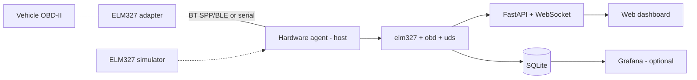

# Architecture

```mermaid
flowchart LR
  Car[Vehicle OBD-II] --- Dongle[ELM327 adapter]
  Dongle ---|BT SPP/BLE or serial| Agent[Hardware agent - host]
  Sim[ELM327 simulator] -.-> Agent
  Agent --> Core[elm327 + obd + uds]
  Core --> API[FastAPI + WebSocket]
  API --> Web[Web dashboard]
  Core --> DB[(SQLite)]
  DB --> Graf[Grafana - optional]
```

Layers: `transport` -> `elm327` -> `obd` / `uds` -> `vehicles` (profiles) -> `analysis` -> `api` / `storage`.
